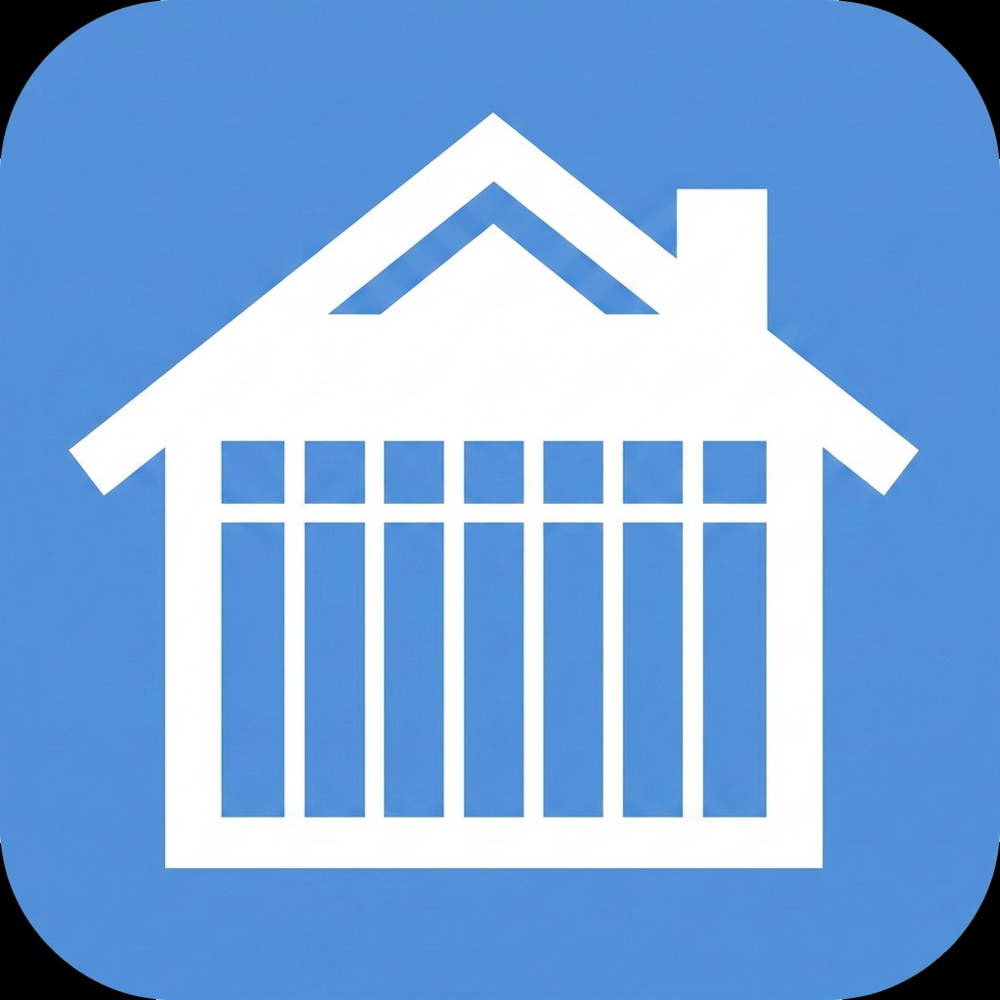

#  WeekPlans - Digital Weekly Schedule Display System

A Flask-based web application designed to display and manage weekly schedules in a digital format. Perfect for home automation displays, information radiators, or any scenario where you need to show and manage weekly plans digitally.

## Features

- 📅 Digital weekly schedule display with multiple plan support
- 🖼️ Customizable screensaver mode with image rotation
- 🔘 Configurable screensaver buttons (show plan1/plan2/all, or custom URL) with position and colors
- 🔄 PDF to image conversion (pages 1 and 2) for easy schedule updates
- 📆 Calendar integration (iCal/Google Calendar) with per-plan assignments and upcoming events
- 📄 Display page selection (page 1 or 2) per plan for the "all" view
- 🗣️ Dashboard language (English, Norwegian Bokmål)
- ⚙️ Admin panel for system management
- 🌐 MQTT integration with Home Assistant discovery (optional)
- 📱 Responsive design for various display sizes
- ⏱️ Configurable display duration
- 🔆 Controls: display on/off, brightness, browser URL, refresh, system restart (via MQTT)
- ⌨️ Keyboard shortcuts: Arrow Left/Right/Up to switch views

## Docker

WeekPlans is designed to run as a single Docker container that serves the frontend (Nginx) and API (Gunicorn).

**Image tags:**
- `stable` or `latest` — production-ready releases (equivalent)
- `beta` — pre-releases for testing
- `2026.02.28.3` — specific version (replace with actual version)

1. Pull the prebuilt image:
   ```bash
   docker pull ghcr.io/snowballchris/weekplans:stable
   ```

2. Run the container:
   ```bash
   mkdir -p data/static data/uploads
   cp example/app-config.example.json data/config.json

   docker run --rm -p 8080:80 \
     -v "$(pwd)/data:/data" \
     ghcr.io/snowballchris/weekplans:stable
   ```

3. Build locally (optional):
   ```bash
   git clone https://github.com/snowballchris/weekplans.git
   cd weekplans
   docker build -t weekplans .
   ```

4. Run the locally built image:
   ```bash
   mkdir -p data/static data/uploads
   cp example/app-config.example.json data/config.json

   docker run --rm -p 8080:80 \
     -v "$(pwd)/data:/data" \
     weekplans
   ```

Then open:
- `http://localhost:8080/` (dashboard)
- `http://localhost:8080/admin` (admin)

Notes:
- `poppler-utils` is included in the image for PDF conversion.
- The `/data` volume holds `config.json`, uploads, and generated images.

### Environment variables (optional)

You can override MQTT settings via environment variables. When set, these take precedence over `config.json` and the admin panel will show them as read-only:

| Variable | Description |
|----------|-------------|
| `WEEKPLANS_ENABLE_MQTT` | Enable MQTT (`1`, `true`, or `yes`) |
| `WEEKPLANS_MQTT_BROKER` | MQTT broker hostname |
| `WEEKPLANS_MQTT_PORT` | MQTT port (default 1883) |
| `WEEKPLANS_MQTT_USER` | MQTT username |
| `WEEKPLANS_MQTT_PASS` | MQTT password |

Example with env vars:
```bash
docker run --rm -p 8080:80 \
  -v "$(pwd)/data:/data" \
  -e WEEKPLANS_ENABLE_MQTT=true \
  -e WEEKPLANS_MQTT_BROKER=homeassistant.local \
  ghcr.io/snowballchris/weekplans:stable
```

## Home Assistant App

WeekPlans can run as a Home Assistant app (formerly add-on). Add this repository in Home Assistant:

1. Go to **Settings** → **Apps** → **App repositories**
2. Add: `https://github.com/snowballchris/weekplans`
3. Install **WeekPlans** from the Apps store
4. Configure MQTT (optional) in the app settings
5. Use the **Open Web UI** button in the Apps view to open the admin panel, or open `http://<your-ha-ip>:8080` for the dashboard and admin

The same Docker image works for both standalone Docker and Home Assistant. MQTT is optional in both modes.

If the apps do not appear after adding the repository:
1. Try refreshing the Apps store (pull to refresh or reload the page)
2. Try adding the repository with the full URL: `https://github.com/snowballchris/weekplans`
3. Remove and re-add the repository
4. Check **Settings → System → Logs** (Supervisor) for any repository loading errors

## Configuration

The application uses several configuration files:

- `config.json`: Main configuration file (copy from `example/app-config.example.json` for first run)
  - Dashboard duration and language
  - Screensaver settings and buttons
  - MQTT configuration
  - Weekplan settings (including display_page)
  - Calendar URLs and per-plan assignments

Example configuration:
```json
{
  "dashboard_duration": 10,
  "dashboard_language": "en-GB",
  "screensaver_config": [],
  "screensaver_buttons": [
    {"enabled": false, "label": "Show Weekplan 1", "action": "plan1", "use_custom_color": false, "color": "#ffffff", "font_color": "auto"},
    {"enabled": false, "label": "Show Weekplan 2", "action": "plan2", "use_custom_color": false, "color": "#ffffff", "font_color": "auto"},
    {"enabled": false, "label": "Show both weekplans", "action": "all", "use_custom_color": false, "color": "#ffffff", "font_color": "auto"},
    {"enabled": false, "label": "Custom URL", "action": "url", "url": "", "use_custom_color": false, "color": "#ffffff", "font_color": "auto"}
  ],
  "screensaver_buttons_position": {"horizontal": "center", "vertical": "bottom"},
  "enable_mqtt": false,
  "mqtt_broker": "homeassistant.local",
  "mqtt_port": 1883,
  "mqtt_user": "",
  "mqtt_pass": "",
  "weekplans": [
    {"key": "plan1", "name": "Weekplan 1", "icon": "1", "display_page": 1},
    {"key": "plan2", "name": "Weekplan 2", "icon": "2", "display_page": 1}
  ],
  "calendar_urls": [],
  "calendar_assignments": {}
}
```

## Usage

The Docker container serves the dashboard and admin interface:
- Main dashboard: `http://localhost:8080/`
- Admin panel: `http://localhost:8080/admin`

## Features in Detail

### Weekly Plans
- Upload PDF schedules that are automatically converted to images (first two pages)
- Support for multiple plans with custom names and icons
- Per-plan display page selection (page 1 or 2) for the "all" view
- Timestamp tracking for last updates

### Screensaver Mode
- Upload images directly or via URLs
- Random rotation of active images
- Enable/disable individual images
- Configurable buttons (show plan1/plan2/all, or custom URL) with customizable position and colors

### Calendar Integration
- Multiple calendars with names and colors
- Assign calendars to specific plans for per-user upcoming events
- Recurring events supported

### MQTT Integration
- Optional integration with home automation systems
- Home Assistant MQTT Discovery (buttons to show plan1/plan2/all)
- Control display brightness, on/off, browser URL, refresh
- System restart and system statistics
- URL control for browser-based displays

### Admin Panel
- System statistics monitoring (Controls tab)
- Configuration management
- Schedule uploads
- Screensaver management (images and buttons)
- MQTT settings
- Display controls (brightness, URL, display on/off, restart)

## Directory Structure

```
weekplans/
├── app.py              # Main Flask application
├── example/
│   └── app-config.example.json  # Example configuration (copy to data/config.json)
├── requirements.txt    # Python dependencies
├── frontend/          # React frontend
├── static/
│   ├── images/        # Converted schedule images
│   ├── screensaver/   # Screensaver images
│   └── js/           # JavaScript files
├── templates/         # HTML templates
└── uploads/          # Temporary PDF storage
```

## Contributing

1. Fork the repository
2. Create your feature branch (`git checkout -b feature/AmazingFeature`)
3. Commit your changes (`git commit -m 'Add some AmazingFeature'`)
4. Push to the branch (`git push origin feature/AmazingFeature`)
5. Open a Pull Request

## License

This project is licensed under the MIT License - see the LICENSE file for details.

## Acknowledgments

- Flask for the web framework
- pdf2image for PDF conversion
- Pillow for image processing
- paho-mqtt for MQTT integration
